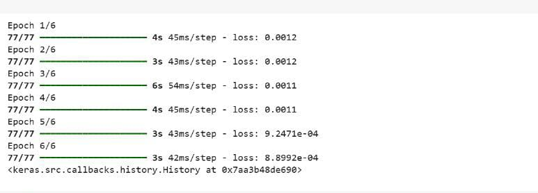
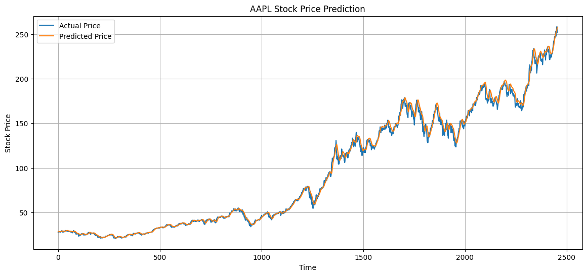

# 📈 FUTURE_ML_02

## Stock Price Prediction Using LSTM

A machine learning project that predicts stock prices using historical data and a Long Short-Term Memory (LSTM) neural network.

---

## 🛠️ Tools Used

- **Python**
- **Keras** (TensorFlow backend)
- **Pandas**, **NumPy**, **Matplotlib**, **Scikit-learn**
- **yFinance** (to fetch stock data)
- **Google Colab** / **Jupyter Notebook**

---

## 📋 Task

- Predict future stock prices using LSTM based on past closing price data.
- Use Apple Inc. (AAPL) stock as a test case.
- Evaluate the model using RMSE and MAE.

---

## 📊 Output

- Predicted stock price for the **next day** based on historical trends.
- Evaluation Metrics:
  - **RMSE (Root Mean Squared Error)**
  - **MAE (Mean Absolute Error)**
- Visualizations comparing **actual vs predicted** prices.

---

## 📉 Forecast Plot

- Below is a sample visualization that shows how well the model forecasts stock prices:

